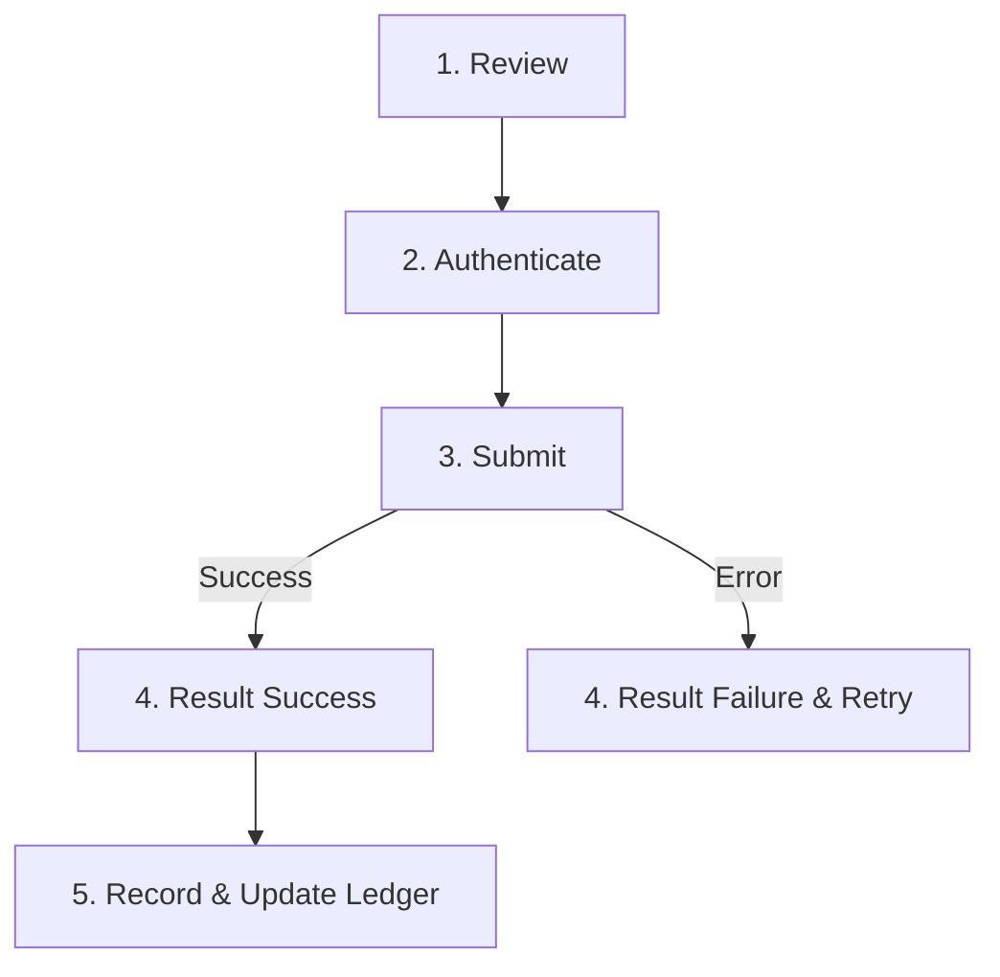

# PayFlex Standard Payment Step Flow Specification

Every money-movement feature in PayFlex (P2P Transfers, QR Payments, Standing Plans, Card Funding, Betting Funding, and Safebox Contributions/Withdrawals) **MUST** follow this standard 5-step payment confirmation architecture. 

This ensures a coherent, secure, and predictable banking experience across all financial interactions in the application.

---

## The 5 Standard Payment Steps



### Step 1: Review
Before any transaction proposal is created or submitted:
- Display clear, un-ambiguous summary of:
  - **Recipient / Destination / Purpose** (e.g. "Safebox: Vacation Fund" or "John Doe (@johnd)")
  - **Amount & Currency** (formatted via `MoneyFormatter`)
  - **Estimated Fee** (explicitly list ₦0.00 or transparent transaction charge)
  - **Source Account / Wallet Balance** after transaction deduction
- Provide an explicit "Confirm & Pay" button to proceed to authentication.

### Step 2: Authenticate
At the moment of payment, every user-initiated action requires active re-confirmation:
- **Interactive Payments** (Transfers, Safebox manual contributions/withdrawals, Card top-ups):
  - Request 4-digit Transaction PIN or Biometric (Fingerprint/FaceID) auth.
  - Never allow silent auto-submission.
- **Pre-Authorized Automatic Payments** (Scheduled Standing Plans, recurring Safebox automated deposits):
  - Skip interactive PIN check.
  - **MANDATORY**: Send an instant push/in-app notification immediately upon execution detailing amount and recipient, since no user was present to confirm.

### Step 3: Submit
Upon successful authentication, transition to the settlement pipeline:
- **Proposal & Signing**:
  1. Call backend/service `createProposal(amount, recipient, source)`
  2. Receive payload to sign -> perform cryptographic signing / PIN hash
  3. Submit signed payload to settlement service (`TransferService`)
- **UI UX**:
  - Show an active in-progress screen utilizing `BrandedLoader`.
  - Disable double-taps or back navigation to prevent duplicate submissions.
  - Never leave the screen visually frozen.

### Step 4: Result
Present an unambiguous terminal state:
- **Success State**:
  - Render the signature `TransferConfirmationAnimation` (brand ribbon drawing and checkmark overlay).
  - Display digital transaction receipt with reference ID, timestamp, and amount.
- **Failure State**:
  - Display a clear, specific failure message (e.g., "Insufficient balance in primary wallet", "Recipient account suspended", "PIN incorrect").
  - **NEVER** display generic error messages like "Something went wrong".
  - Provide a "Retry Transaction" button or "Adjust Amount" option.

### Step 5: Record
Immediately register the completed transaction into relevant state ledgers:
- Update personal wallet balance in `WalletState`.
- Append entry into personal transaction history feed.
- Append entry into feature-specific ledger (e.g. `SafeboxTransaction` feed) without requiring a manual pull-to-refresh.

---

## Reusable Component Reference

In the Flutter application, this flow is encapsulated inside:
`file:///home/gamp/bpay/lib/components/payment_confirmation_flow.dart`

### Basic Usage Example:
```dart
PaymentConfirmationFlow.show(
  context: context,
  title: 'Contribute to Safebox',
  recipientName: 'Family House Fund',
  amount: 15000.0,
  currency: 'NGN',
  fee: 0.0,
  onAuthenticate: (pin) async {
    return pin == '1234'; // Validate PIN
  },
  onSubmit: () async {
    return await SafeboxService().contribute(safeboxId: id, amount: 15000.0);
  },
  onSuccess: (receipt) {
    // Record & update state
  },
);
```
